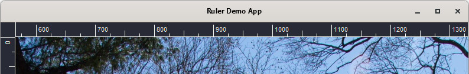

# gtk4-custom-ruler-widget

A custom widget for GTK 4 which displays a ruler.

The ruler can display a range between two floating point numbers with integer intervals between major ruler ticks. The interval will automatically adjust based on the given range and the allocated width/height for the ruler.



## Table of contents

[TOC]

## Install

The library can be built using CMake and requires version 3.20 or higher.

1. Download the latest release.

2. Extract the archive and navigate to the root of the project.

3. Execute the following commands:

   ```bash
   mkdir build
   cmake .. -DCMAKE_BUILD_TYPE=Release --install-prefix <your-project-root>
   cmake --build .
   cmake --install .
   ```
4. The library will now have installed `<your-project-root>/include/crw-ruler.h` and `<your-project-root>/libs/libcrwruler.a`


## Usage

### Adding ruler

Add using `crw_ruler_new()`:

```c
// ...

GtkWidget *window;
GtkWidget *grid;
GtkWidget *ruler;

window = gtk_application_window_new (app);
gtk_window_set_title (GTK_WINDOW (window), "Window");
gtk_window_set_default_size (GTK_WINDOW (window), 200, 200);

grid = gtk_grid_new ();
gtk_window_set_child (GTK_WINDOW (window), grid);

ruler = crw_ruler_new(GTK_ORIENTATION_HORIZONTAL);
gtk_widget_set_hexpand(ruler, true);
gtk_grid_attach (GTK_GRID (grid), ruler, 1, 0, 1, 1);

gtk_widget_show (window);

// ...
```

Add using GtkBuilder:

`builder.ui`

```xml
<?xml version="1.0" encoding="UTF-8"?>
<interface>
    <object id="window" class="GtkWindow">
        <property name="title">Ruler Demo App</property>
        <child>
            <object id="grid" class="GtkGrid">
                <child>
                    <object id="hruler" class="CrwRuler">
                        <property name="orientation">horizontal</property>
                        <property name="hexpand">1</property>
                        <layout>
                            <property name="column">1</property>
                            <property name="row">0</property>
                        </layout>
                    </object>
                </child>
            </object>
        </child>
    </object>
</interface>
```

`main.c`

```c
// ...

GError *error = NULL;

// We have to call get_type before using GtkBuilder, otherwise there's a chance
// it won't recognize the CrwRuler class
crw_ruler_get_type();

GtkBuilder *builder = gtk_builder_new();
if (gtk_builder_add_from_file (builder, "builder.ui", &error) == 0)
{
    g_printerr ("Error loading file: %s\n", error->message);
    g_clear_error (&error);
    return;
}

gtk_widget_show (GTK_WIDGET(window));
g_object_unref(builder);

// ...
```

### Set ruler range

```c
double lower_limit;
double upper_limit;

// ...

crw_ruler_set_range(CRW_RULER(ruler), lower_limit, upper_limit);
```

The ruler does not scroll. If the ruler should "track" some kind of viewport, it must be manually kept up-to-date by updating the ruler range whenever the viewport moves. For a simplistic example, see `demo-app/main.c`.

### Styling

`CrwRuler` has a single CSS node with the name `ruler`. The background and foreground color can be styled with CSS, using the `background-color` and `color` properties, respectively. Currently, the font cannot be styled using CSS.

```css
ruler {
   background-color: #fff;
   color: #000;
}
```

The length of the tick lines can be set using `crw_ruler_set_major_tick_length()`. The length is expressed as a fraction of the height of a horizontal ruler, or a fraction of the width of a vertical ruler.

The minimum spacing in pixels between the major ruler ticks can be set using `crw_ruler_set_min_major_tick_spacing()`.  The currently set range will be displayed using an interval such that the spacing between major ticks is at least of the set size.

## Acknowledgements

Central Park, NYC photo by George Hodan, released under a CC0 Public Domain license.

This ruler is a complete rewrite of the ruler written for [Scroom](https://github.com/kees-jan/scroom), during the 2021 TU/e SEP. Special thanks to Kees-Jan Dijkzeul, the maintainer of Scroom, for his advice during the project.

## TODO

 * Add font styling through CSS (preferred) or properties.